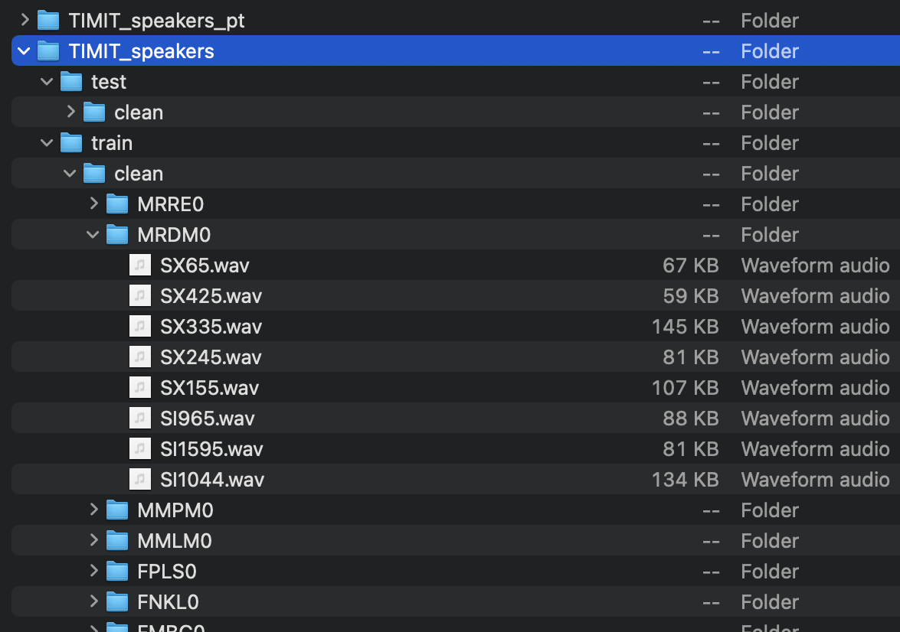

# Simple Audio Analysis

## Process TIMIT speech (audio) data
We convert the wave form (.wav) files to [**spectrograms**](https://en.wikipedia.org/wiki/Spectrogram) via [Short-Time Fourier Transform](https://en.wikipedia.org/wiki/Short-time_Fourier_transform)

I mainly modify the code from [this Github](https://github.com/hsinyilin19/Discriminator-Constrained-Optimal-Transport-Network).
- In folder **preprocessing_TIMIT**, replace `TIMIT_path` and `target_root` in `step1_generate_clean_files.py` and `step2_convert_to_pt.py`.
- `TIMIT_path` is the audio source (TIMIT).
- `target_root` is the place to save the converted STFT files
- then run `step1_generate_clean_files.py` and `step2_convert_to_pt.py` in order.
  
and you will see something like this:

## Package Requirement:
- PyTorch (2.3.0), Torchvision (0.18.1), Torchaudio (2.3.1); installation see [Pytorch](https://pytorch.org/get-started/locally/) (e.g. `pip3 install torch torchvision torchaudio`)
